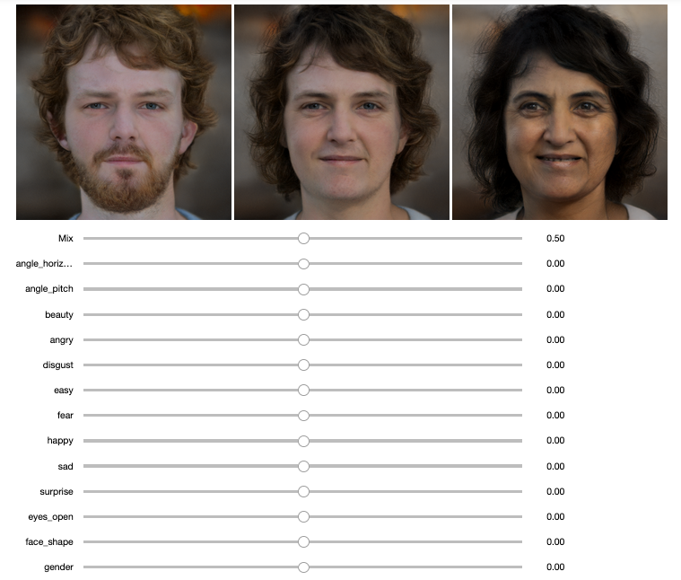
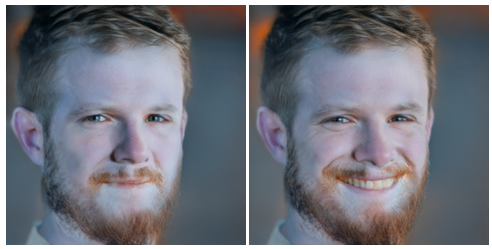

This repo contains two jupyter notebooks that provide a minimal example for how one may interact with the official Stylegan2 TensorFlow implementation.

The work in this repo relies on and was based heavily on the following repos:
- https://github.com/NVlabs/stylegan2
- https://github.com/rolux/stylegan2encoder
- https://github.com/Puzer/stylegan-encoder
- https://github.com/a312863063/generators-with-stylegan2


The jupyter notebooks include code that allows one to:
- Convert any JPG or PNG image into their StyleGan2 latent representations
- Modify the latent representations
- Generate images from latent representations


Several precomputed "latent directions" are also made available.
These latent directions are pulled from the following repo:
```
https://github.com/a312863063/generators-with-stylegan2
```
For example, This allows one to move a latent vector in the smile direction to increase an image's smile.




For a complete list of latent directions available, see:
```
https://github.com/a312863063/generators-with-stylegan2/tree/master/latent_directions
```
